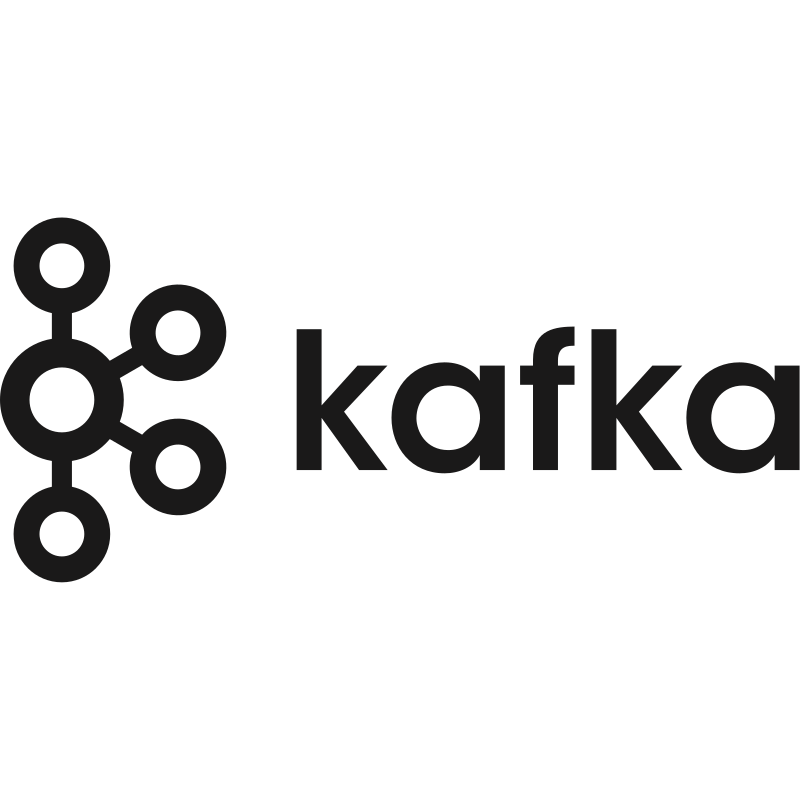
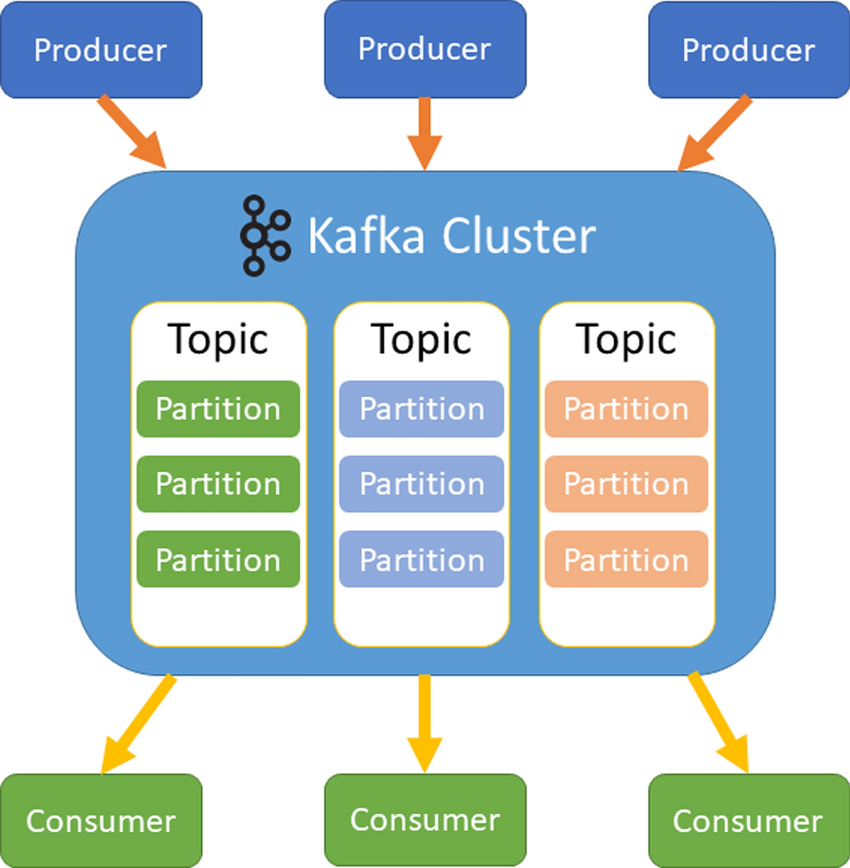
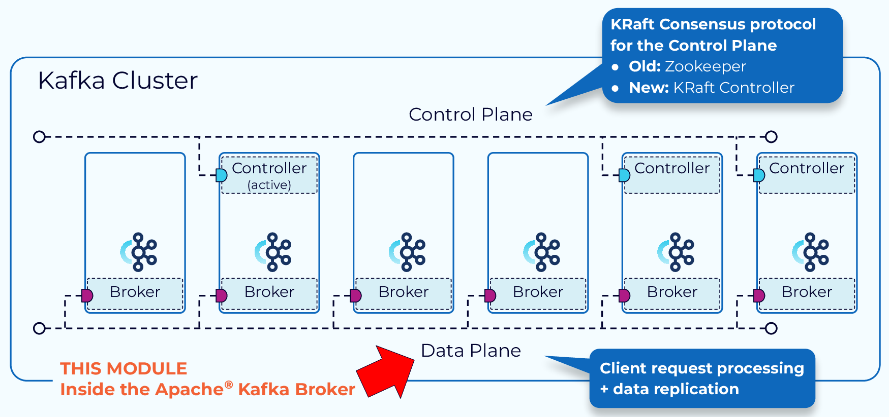
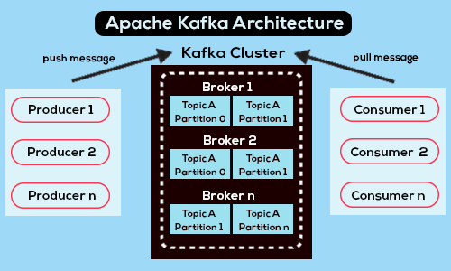
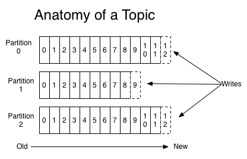
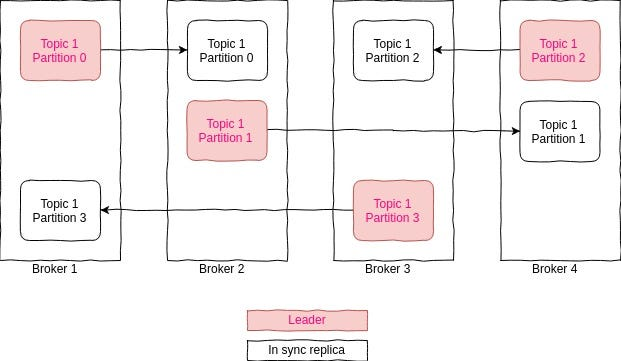
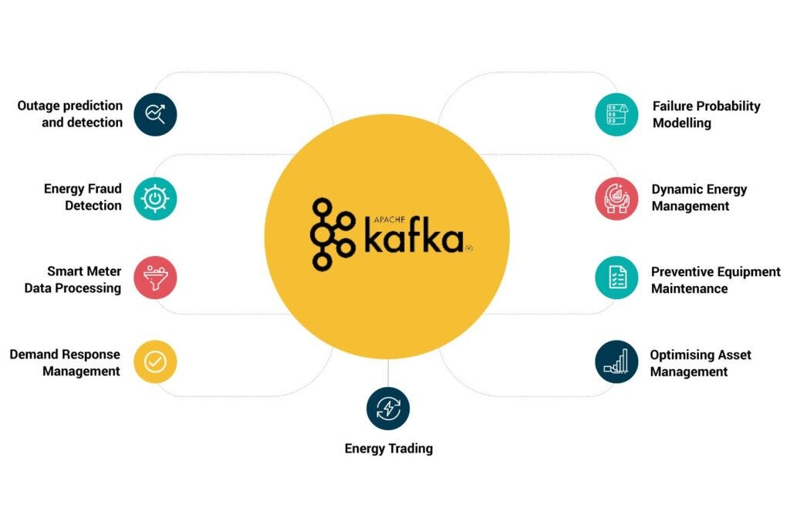

# Apache Kafka: Brokers and Topics

An introduction to Kafka's core concepts, with a live demo.

*Presented by Nathan Antonietti*
*Date: 25.09.25*

---

## What is Apache Kafka?

- **Kafka** is an open-source distributed event streaming platform.
- Developed by LinkedIn (now Apache project), it's designed for high-throughput, fault-tolerant, real-time data pipelines.
- Key use: Handling massive streams of data (e.g., logs, metrics, events) between systems.
- Core idea: Treat data as streams of events, not batches.

**Why Kafka?** Scalable, durable, and supports pub-sub messaging.

 <!-- Kafka logo image -->

---

## Kafka's High-Level Architecture

Kafka is a distributed system with:
- **Producers**: Send data to topics.
- **Consumers**: Read data from topics.
- **Brokers**: Servers that store and manage data.
- **Topics**: Logical channels for data streams.

---

## Kafka's High-Level Architecture

 <!-- Kafka Architecture Diagram -->
[Reference: Novell Zenworks — Kafka documentation](https://www.novell.com/documentation/zenworks-24.4/zen_kafka/data/zen_kafka.html)

---

## What are Brokers?

- **Brokers** are the Kafka server processes that form the cluster.
- Each broker is a node (machine/container) running the Kafka software.
- They store data, handle requests, and replicate for fault tolerance.
- A cluster typically has 3+ brokers for production (odd number for quorum).

**Key Point:** Brokers don't know about individual producers/consumers; they manage storage and replication.

---

## Broker Responsibilities

1. **Data Storage**: Persist messages to disk (immutable logs).
2. **Serving Requests**: Handle produce (write) and fetch (read) from clients.
3. **Replication**: Copy data across brokers for redundancy.
4. **Leader Election**: One broker leads a partition; others follow.
5. **Partition Management**: Assign and balance partitions across brokers.

Brokers use KRaft (Kafka Raft) for metadata instead of ZooKeeper in newer versions.

---

## Broker Responsibilities

 <!-- Broker Workflow -->
[Reference: Confluent - Kafka Brokers](https://developer.confluent.io/courses/architecture/broker/)

---

## Brokers in a Cluster

- **Single Broker**: Simple, but single point of failure.
- **Multi-Broker Cluster**: Distributes load, enables replication.
  - Partitions are spread across brokers.
  - If one fails, others take over (followers become leaders).

Example: 3-broker cluster with replication factor 3 → No data loss on 2 failures.

---

## Brokers in a Cluster

 <!-- Kafka docs diagram of brokers -->
[Reference: ProjectPro — Kafka architecture](https://www.projectpro.io/article/apache-kafka-architecture-/442)

---

## What are Topics?

- **Topics** are categories or feeds where data is published.
- Like a "channel" for related events (e.g., "user-clicks", "orders").
- Topics are append-only logs: Messages are never deleted (retention configurable).
- Producers write to topics; consumers subscribe to them.

**Analogy:** A topic is like a mailing list—publishers send, subscribers receive.

---

## Topics and Partitions

- Topics are divided into **partitions** for parallelism and scalability.
- Each partition is an ordered, immutable sequence of messages (a log).
- Partitions allow:
  - Horizontal scaling: More partitions → More consumers can read in parallel.
  - Ordering: Messages in a partition are strictly ordered.

---

## Topics and Partitions

 <!-- Topic Partitions -->
[Reference: dattell — Kafka documentation](https://dattell.com/data-architecture-blog/what-is-a-kafka-topic/)

---

## Replication in Topics

- **Replication Factor**: Number of copies per partition (e.g., 3).
- Each partition has a **leader** (handles reads/writes) and **followers** (replicas).
- Leaders are distributed across brokers for balance.
- If leader fails, a follower is promoted (high availability).

Config: `--replication-factor 2` means each partition on 2 brokers.

---

## Replication in Topics

 <!-- Replication Diagram -->
[Reference: medium.com @_amanarora — Kafka replication](https://medium.com/@_amanarora/replication-in-kafka-58b39e91b64e)

---

## Live Demonstration Setup

Using Docker Compose for a 2-broker Kafka cluster (KRaft mode).

**Project Files:**
- `docker-compose.yaml`: Starts 2 brokers + Kafka UI (localhost:8080).
- `producer.py`: Sends JSON messages to 'demo-topic'.
- `consumer.py`: Reads from topic (now with `group_id` param).

Run: `docker-compose up -d` to start brokers.

---

## Demo: Creating the Topic

1. Start brokers: `docker-compose up -d`.
2. Create topic with 2 partitions, replication 2:

docker exec kafka-deploy-kafka-1 kafka-topics.sh --create --topic demo-topic --bootstrap-server localhost:9092 --partitions 2 --replication-factor 2

3. Verify: `kafka-topics.sh --describe --topic demo-topic`.

**Output:** PartitionCount: 2, ReplicationFactor: 2.
Leaders on different brokers!

View in UI: http:localhost:8080.

---

## Demo: Producer Sending Messages

Run: `python producer.py`

- Sends 5 messages to 'demo-topic' (round-robin to partitions).
- Bootstrap servers: localhost:9092,9095 (our brokers).
- Messages: `{'event_id': 1, 'message': 'This is event number 1'}` etc.

**Behind the Scenes:** Producer connects to brokers, assigns to partitions, replicates.

---

## Demo: Consumers Receiving Messages

Run in two terminals (different groups for full broadcast):

1. `python consumer.py group1`
2. `python consumer.py group2`

- Each consumer reads ALL messages (separate groups = independent offsets).
- With same group: Load-balanced (one per partition).

**Observation:** Both get all 5 messages. Restart to see rebalancing!

If same group: Messages split (e.g., 3 to one, 2 to other).

---

## Use Cases for Kafka

1. **Real-Time Streaming**: Process live data (e.g., Netflix uses for user events).
2. **Log Aggregation**: Centralize logs from apps (e.g., ELK stack integration).
3. **Microservices Communication**: Async event-driven architecture (e.g., order placed → notify inventory).

Brokers ensure durability; Topics organize streams.

---

## More Use Cases: Brokers and Topics

- **Brokers**: Fault-tolerant storage in IoT (e.g., sensor data across geo-distributed brokers).
- **Topics with Partitions**: High-throughput analytics (e.g., Uber: Partition by region for parallel processing).
- **Advanced**: Stream processing with Kafka Streams/KSQL for joins, filters.

**Benefits:** Decouples producers/consumers, scales to petabytes.

---

## More Use Cases: Brokers and Topics

 <!-- Use Cases Infographic -->
[Reference: medium.com @sachin28 — Kafka Use Cases](https://medium.com/@_amanarora/replication-in-kafka-58b39e91b64e)

---

## Conclusion

- Kafka: Powerful for event streaming.
- Brokers: Manage storage, replication, and availability.
- Topics: Organize data into scalable, partitioned logs.
- Demo shows real-world basics—extend for production!

Questions? Explore: kafka.apache.org

Thank you!

---